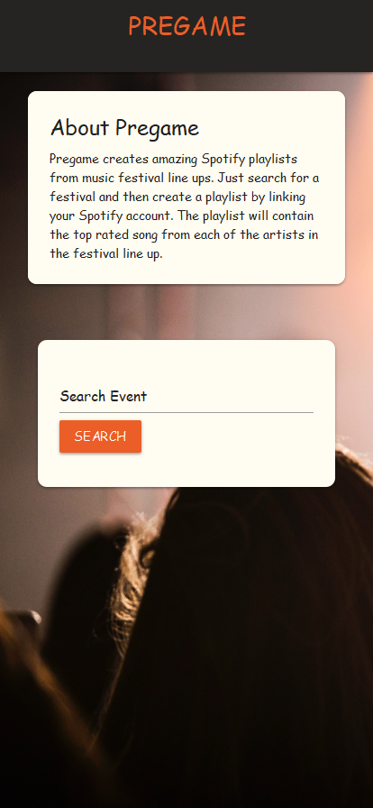
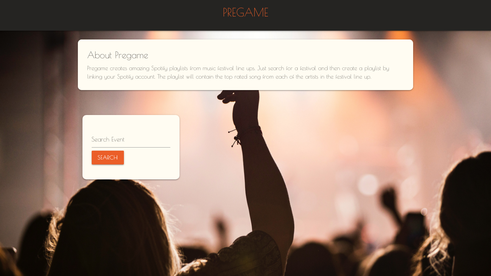

# Playlist

Create a playlist from music festival lineups

## Table of Contents
1. [Installation](#installation)
1. [Usage](#usage)
   1. [Screenshots](#screenshots)
1. [License](#license)
1. [Contributing](#contributing)
1. [Tests](#tests)
1. [Questions](#questions)

## Installation
none

## Usage
Search a festival name then click on create playlist
### Screenshots
[Live Deployed Link](https://tbellenger.github.io/playlist/)
### Mobile

### Browser

  

## License
[MIT License](https://mit-license.org/)
  

## Contributing
none

## Tests
none

## Questions
[Find me on Github](https://github.com/tbellenger)

Or you can contact me at tbellenger@gmail.com if you have any questions

